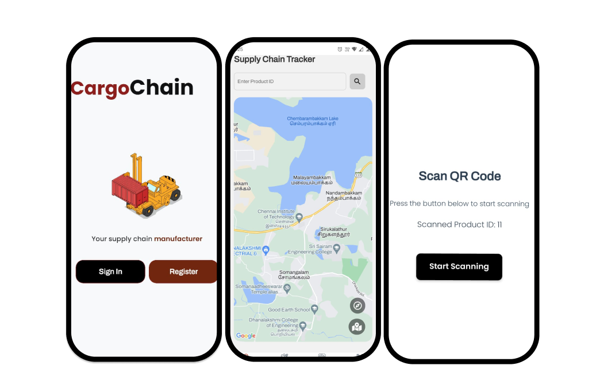

# 🚀 **IndusChain**  
### _Where IoT, Blockchain, and AI Converge for Smart Solutions_  

[](LICENSE)   
    

---

## 📖 **Table of Contents**  
1. [Project Overview](#project-overview)  
2. [Features](#features)  
3. [Architecture](#architecture)
4. [Technology Stack](#technology-stack)  
5. [Installation and Setup](#installation-and-setup)  
6. [Usage Guide](#usage-guide)  
7. [Screenshots](#screenshots)  
8. [API Documentation](#api-documentation)  
9. [Future Improvements](#future-improvements)  
10. [Contributing](#contributing)  
11. [License](#license)  
12. [Contact Us](#contact-us)  

---

## 🌍 **Project Overview**  
IndusChain is a powerful blockchain and AI-powered platform for smart industrial and supply chain solutions. IndusChain offers a wide variety of features varying from supply chain verification to predictive maintenance based upon industry and promoting sustainable practices with energy forcasting based upon seasonal context data. 

The platform enhances **sustainability and transparency** by combining blockchain-based smart contracts with real-time sensor data. Our mission is to empower  manufacturers, and supply chains with **data-driven decisions** for operational excellence.

---

## ✨ **Features**  

### 1. Predictive Maintenance 
- **AI-powered predictive maintenance** reduces machine downtime by analyzing sensor data.  
- **Real Machine factors** The model is based upon several factors encountered in real life predictive maintenance in industries like process temperature, torque and tool wear

### 2. Energy Forecasting  
- **Prediction based on time context data** gives out near accurate predictions for future energy use by a manufacturing plant. 

### 3. CargoChain – Product Verification on the Supply Chain  
- **Tracks product origin** and movement to ensure authenticity.  
- Utilizes **blockchain-based smart contracts** to validate product origins.  
- Ensures **transparency in supply chain transactions** from start to finish.

---

## ⚙️ **Technology Stack**   
- **Blockchain**: Ethereum, Solidity Smart Contracts  
- **AI/ML**: SKLearn, Python, XGBoost Models 
- **Front end development**: React.js, Node.js, Vite
- **Backend development**: Express.js, Prisma, AWS deployment
- **Mobile App (CargoChain)**: React Native, Expo
- **Communication**: Axios, Appwrite

---

## 🚀 **Installation and Setup**  

### Prerequisites  
- **Node.js and npm** installed  
- **Python environment with SKLearn, numpy and pandas** installed
- **React-native and Expo app** installed

### Steps to Install  
1. **Clone the Repository**  
   ```bash
   git clone https://github.com/username/induschain.git
   cd induschain
   ```

2. **Install Backend Dependencies**  
   ```bash
   cd manufacturing_backend
   npm install
   ```

3. **Set up Frontend**  
   ```bash
   cd manufacturing_ui
   npm install
   npm run dev
   ```
4. **Set up models**
   ```bash
   cd manufacturing_ui
   cd predictive_model
   cd ..
   cd forecast_energy_model
   ```
   both of these directories contain the model architecture in the main_model.ipynb file. 

---


## 🖼 **Preview**  
### 1. Web Portal – Dashboard  
  

### 2. Predictive Maintenance Alerts  
  

### 3. CargoChain Mobile App  
  

---

## 📑 **API Documentation**  
Here are the key API endpoints available for developers:  

- **POST /api/register**: Signup on the website 
- **POST /api/login**: Login on the website
- **GET /api/protected**: Protected route on the website
- **POST /api/plants/create**: Create a plant
- **POST /api/plants/add-manager**: add a manager to a plant
- **POST /api/plants/add-engineer**: add an engineer to a plant
- **GET /api/plants/details/:plantId**: get plant details

---

## 🚀 **Future Improvements**  
- **Detailed energy report** with specific machine data, and energy losses. 
- **Higher hierarchial management** in company establishments and database with better access control and multi plant management system
- **Enhanced visualization dashboards** with data analytics tools.  
- **Multi-blockchain compatibility** (e.g., Polygon, Binance Smart Chain).

---

## 🤝 **Contributing**  
We welcome contributions to make IndusChain better!  

1. **Fork the repository**  
2. **Create a new branch**  
   ```bash
   git checkout -b feature-branch-name
   ```
3. **Commit your changes**  
   ```bash
   git commit -m "Added new feature"
   ```
4. **Push to the branch**  
   ```bash
   git push origin feature-branch-name
   ```
5. **Open a pull request**

---

## 📜 **License**  
This project is licensed under the MIT License - see the [LICENSE](LICENSE) file for details.

---

## 📧 **Contact Us**  
For queries or support, feel free to reach out at:  
- **Email**: hemang.seth@iiitb.ac.in, Tanish.Pathania@iiitb.ac.in
- **Linkedin**: [Aryaman Pathak]([http://www.induschain.io](https://www.linkedin.com/in/aryaman-pathak/)) , [Siddharth Vikram](https://www.linkedin.com/in/siddharth-vikram-523835219/)
